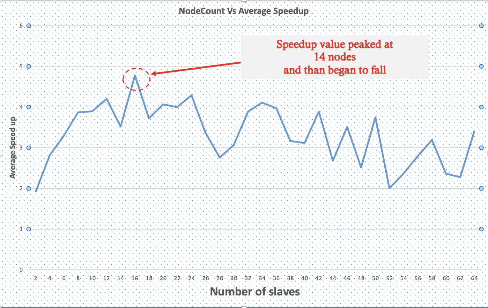

# Distributed Search Algorithm

> This is developed as a part of course work in CS420 at Southern Illinois University, Carbondale


# About

* Given 
  * a large chunk of numbers in the form of a data vecotor (integer array in C) 
  * along with a relatively small vector of numbers called the query vector, 
  * we perform a search algorithm to find all values that are present in both.


We first perform a sequential search and then repeat the same process by performing a distributed search algorithm and later compare and contrast the results in their performances. 

## Distributed Search Algorithm

* Initialize a distributed system with ```n``` nodes that follow a master-slave architecture.
  ```C
        MPI_Init(&argc, &argv);
        MPI_Comm_size(comm, &np); 
  ```


* The master node initiates the process by initializing data vector and query vector. 
* Then asynchronously sends and the query vector to all the slave nodes waits for acknowledgement .
  
  ```C
   // Send the query vector to all slaves and wait for an acknowledgement
    int ack;
    for(int i = 1;i<np;i++){
            MPI_Isend(query_vector, QUERY_SIZE, MPI_INT, i, QUERY_MSG_TAG, comm, &request);
            MPI_Irecv(&ack, 1, MPI_INT, i, ACK_MSG_TAG, comm, &requests[i-1]);
    }
    MPI_Waitall(slave_count,requests,statuses);
    ```
* Later, master node divides the data vector into ```n-1``` chunks and sends each chunk to one slave. 

* On the slaves side, every slave sends an ```ack``` to master as soon as it received the query vector and waits for the partial data vactor to be sent. 
* Upon receiving the partial data vector, each slave then performs sequential search and returns partial results back to the master. 

* As soon as slaves respond with their partial result vecotrs, master node shall begin accumulating to produce the final result(Here we call the ```print_found``` function)


## Analysis
This is an analysis on the hypothesis 
> As number of nodes increase, the performance of the overall system decreases due to the overhead added due to communication between nodes. 

We perform the above operation with different values for ```n``` and try to analyse the value of ```Speed up``` factor which is the ratio between sequential search time and parallel search time. 

We see that as the numnber of nodes increased, the performance peaked at ```n = 14``` and then slowly plummetted. 




#### Implementation details
* Built using MPI(Message Passing Interface) library in C.
* For more details on how to compile and run mpi programs in C, please click [here](http://condor.cc.ku.edu/~grobe/docs/intro-MPI-C.shtml).
